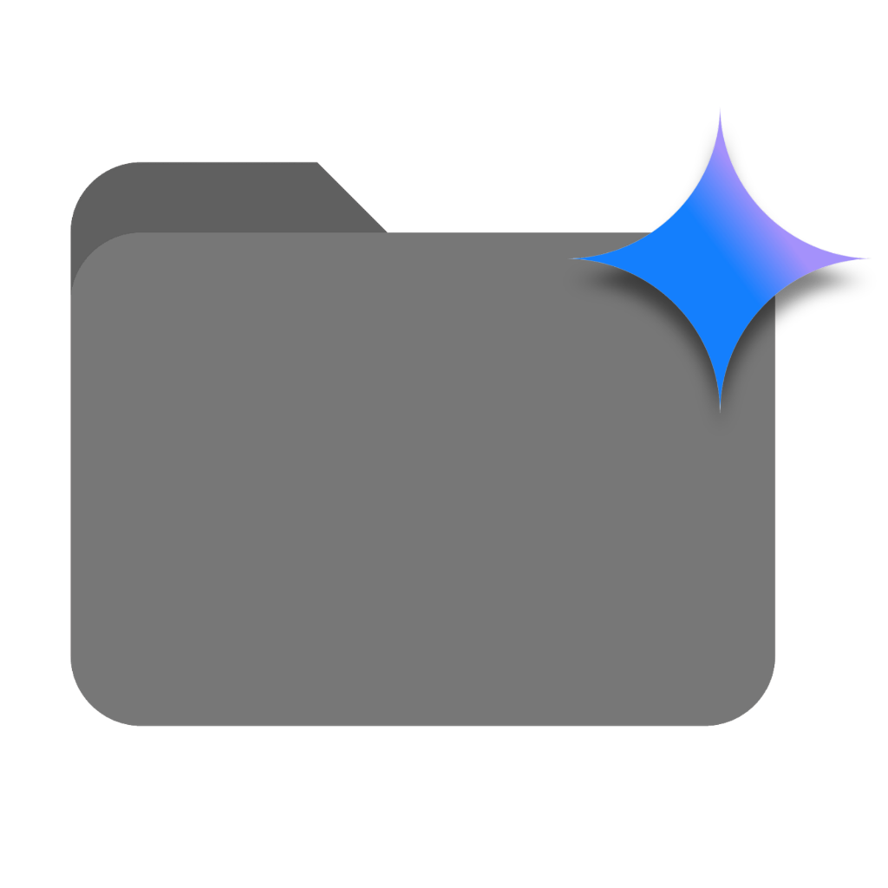

# Gemini Folders

> Organize your Google Gemini AI chats into folders — right inside the sidebar.

<p align="center">
  
</p>

A Chrome extension that adds a fully-featured folder system to Google Gemini's sidebar. Create folders, drag chats in, search across everything — and keep your AI conversations organized.

## ✨ Features

- **Create folders** to group related Gemini conversations
- **Add/remove chats** to any folder with a click
- **Search** across folders and chat titles instantly
- **Auto-expand** the folder containing your currently active chat
- **Deep scroll** to discover older conversations not yet loaded by Gemini
- **Multi-device sync** — folders are saved to Firebase and follow your Google account
- **Native look & feel** — styled to blend seamlessly with Gemini's UI

## 🛠 Tech Stack

| Layer | Technology |
|-------|------------|
| Framework | [Plasmo](https://docs.plasmo.com/) (Chrome Extension) |
| UI | React 18 + Tailwind CSS |
| Language | TypeScript |
| Backend | Firebase Auth + Firestore |
| Interception | XHR/Fetch monkey-patching in MAIN world |

## 🚀 Getting Started

### Prerequisites

- **Node.js** 18+ and **pnpm** installed
- A [Firebase project](https://console.firebase.google.com/) with Firestore and Authentication enabled
- A Chrome browser

### Setup

1. **Clone the repo**
   ```bash
   git clone https://github.com/aghori3004/gemini-folders.git
   cd gemini-folders/gemini-app
   ```

2. **Install dependencies**
   ```bash
   pnpm install
   ```

3. **Configure environment variables**

   Create a `.env` file in the project root:
   ```env
   PLASMO_PUBLIC_FIREBASE_API_KEY=your_api_key
   PLASMO_PUBLIC_FIREBASE_AUTH_DOMAIN=your_project.firebaseapp.com
   PLASMO_PUBLIC_FIREBASE_PROJECT_ID=your_project_id
   PLASMO_PUBLIC_FIREBASE_STORAGE_BUCKET=your_project.appspot.com
   PLASMO_PUBLIC_FIREBASE_MESSAGING_SENDER_ID=your_sender_id
   PLASMO_PUBLIC_FIREBASE_APP_ID=your_app_id
   PLASMO_PUBLIC_FIREBASE_MEASUREMENT_ID=your_measurement_id
   ```

4. **Start the development server**
   ```bash
   pnpm dev
   ```

5. **Load the extension in Chrome**
   - Go to `chrome://extensions`
   - Enable **Developer mode**
   - Click **Load unpacked**
   - Select the `build/chrome-mv3-dev` folder

### Production Build

```bash
pnpm build
```

The production bundle is generated in `build/chrome-mv3-prod`, ready to be zipped and submitted to the Chrome Web Store.

## 📁 Project Structure

```
src/
├── background.ts          # Service worker (auth token, popup)
├── content.tsx             # Inline content script (UI injector)
├── firebase.ts             # Firebase config & initialization  
├── popup.tsx               # Extension popup (login/logout)
├── types.ts                # TypeScript interfaces
├── style.css               # Tailwind entry + shadow DOM reset
├── utils/
│   └── logger.ts           # Dev-only logging utility
├── hooks/
│   ├── useAuth.tsx          # Google Sign-In + session sync
│   ├── useChatScraper.tsx   # XHR interception + deep scroll
│   └── useFolderStore.tsx   # Firestore CRUD for folders
├── contents/
│   └── interceptor.ts      # MAIN world network interceptor
└── components/
    ├── MainUI.tsx           # Root UI controller
    ├── FolderList.tsx       # Folder list renderer
    ├── FolderItem.tsx       # Individual folder + chat items
    ├── CreateFolderModal.tsx # New folder creation dialog
    ├── AddChatModal.tsx     # Add/remove chats dialog
    └── ErrorBoundary.tsx    # React error boundary
```

## 🔒 Privacy

This extension collects **only** what's needed to organize your chats:
- Google account info (for authentication)
- Chat titles and IDs (for folder organization)
- Folder names you create

**We do not** read chat message content, track browsing, or share data with third parties.

See the full [Privacy Policy](PRIVACY_POLICY.md).

## 📄 License

This project is licensed under the MIT License — see [LICENSE](LICENSE) for details.

## 🤝 Contributing

Contributions are welcome! Please:

1. Fork the repo
2. Create a feature branch (`git checkout -b feature/awesome-feature`)
3. Commit your changes (`git commit -m 'Add awesome feature'`)
4. Push to the branch (`git push origin feature/awesome-feature`)
5. Open a Pull Request

## 📬 Contact

**Divyansh Gangwar** — [divyanshgangwar3004@gmail.com](mailto:divyanshgangwar3004@gmail.com)
